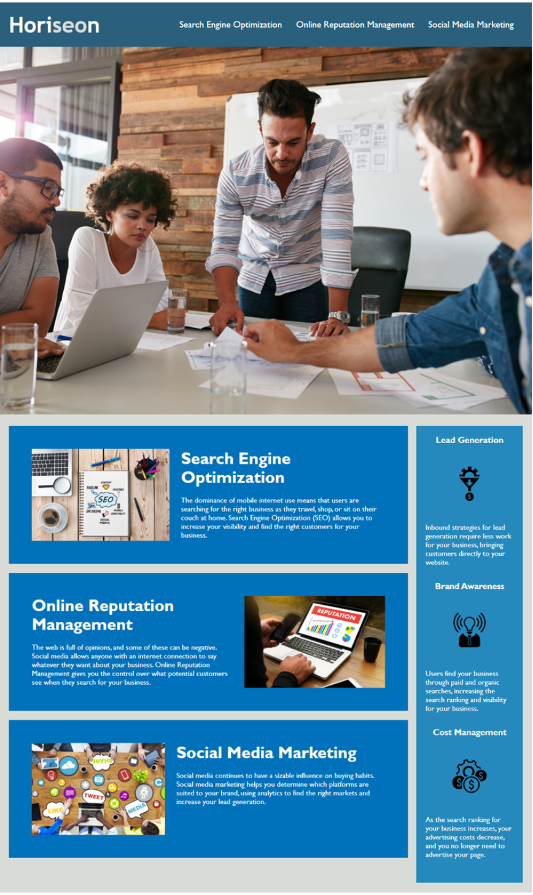

# <Module-1-Challenge>

## Description

For this challenge, our job as students was to edit, consolidate, and organize the html and css file to follow semantic structure. The web application's appearance was to remain the same.

My motivation to complete this challenge was to become a better coder and aquire new skills. I learned that in order to reach the final goal in web development, it can take a lot of trial and error.

## Usage

## Credits

https://umn.bootcampcontent.com/University-of-Minnesota-Boot-Camp/UofM-VIRT-FSF-PT-10-2022-U-LOLC
